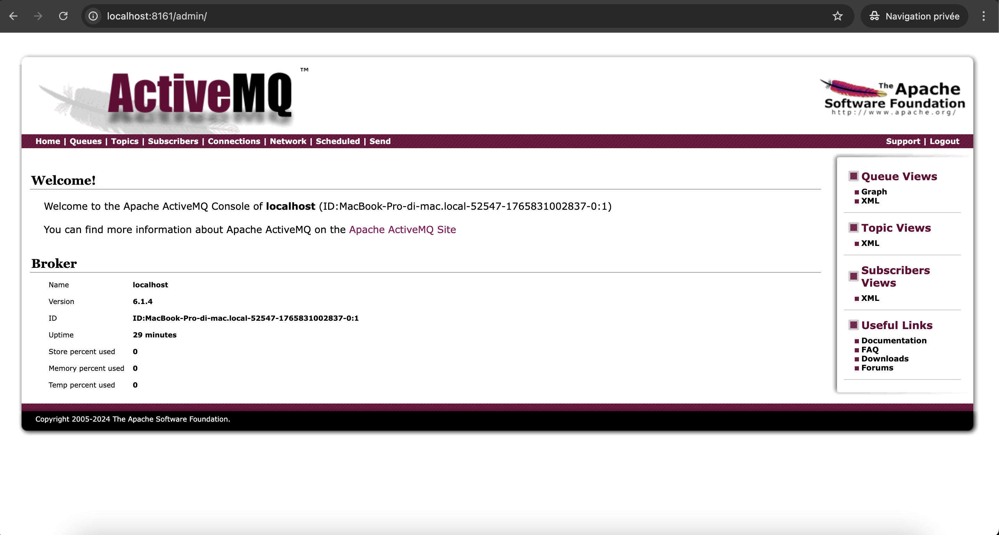
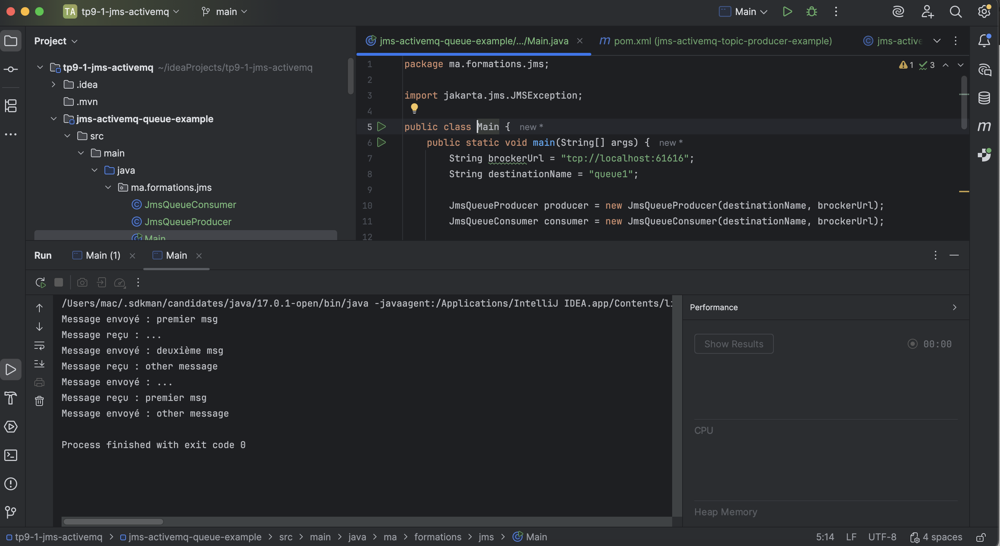
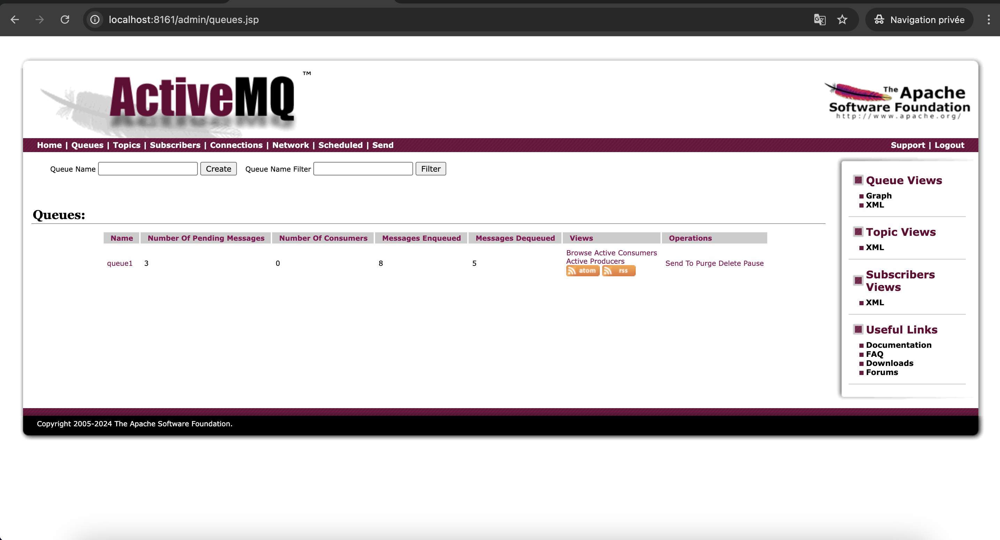
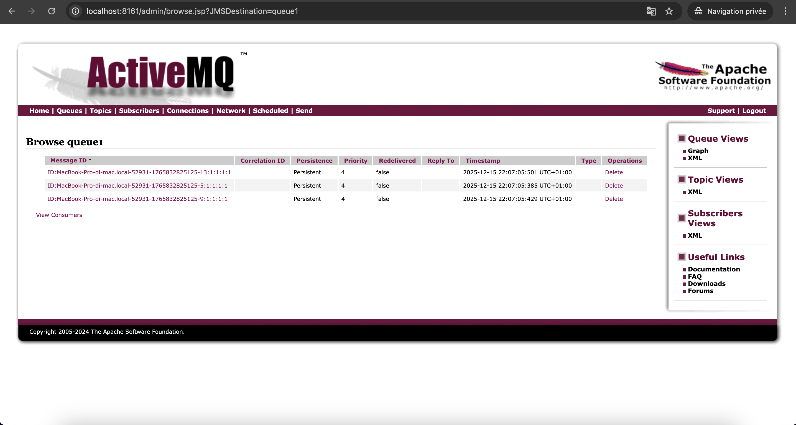
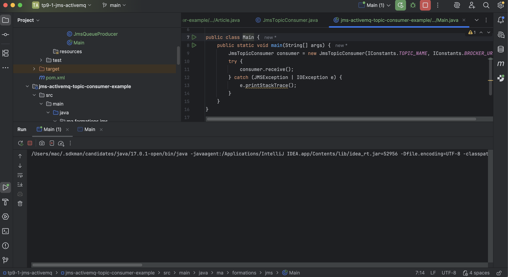
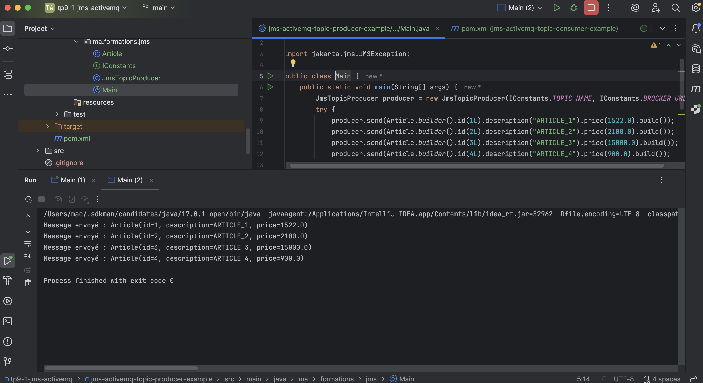
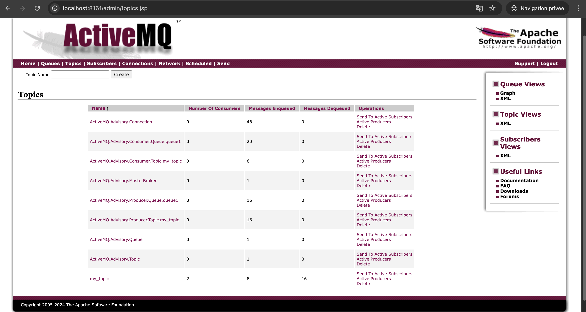
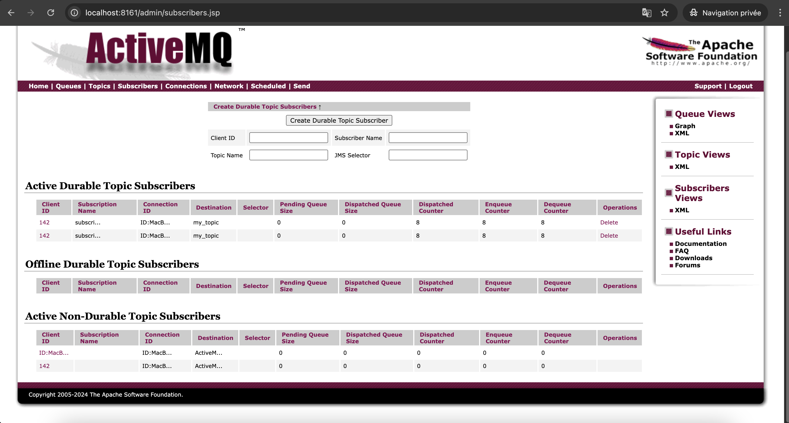

# TP 9-1 — Java Message Service (JMS) avec Apache ActiveMQ


Projet du **TP 9-1 – Java Message Service (JMS)**.  
Ce TP a pour objectif de **mettre en œuvre la communication asynchrone** entre applications Java à l’aide de **JMS** et du broker **Apache ActiveMQ**.

Le projet couvre les deux modèles fondamentaux de JMS :
- **Point-to-Point (Queue)**
- **Publish / Subscribe (Topic)** avec **Durable Subscribers**

---

## 📌 Sommaire

1. [Objectifs du TP](#-objectifs-du-tp)
2. [Concepts JMS](#-concepts-jms)
3. [Stack technique](#-stack-technique)
4. [Architecture du projet](#-architecture-du-projet)
5. [Modules du projet](#-modules-du-projet)
6. [Broker ActiveMQ](#-broker-activemq)
7. [Démarrage rapide](#-démarrage-rapide)
8. [Tests & démonstrations](#-tests--démonstrations)
9. [Interface Web ActiveMQ](#-interface-web-activemq)
10. [Auteurs](#-auteurs)
11. [Licence](#-licence)

---

## 🎯 Objectifs du TP

- Comprendre l’architecture **JMS**
- Mettre en place un **broker de messages (ActiveMQ)**
- Implémenter :
    - un **Producer**
    - un **Consumer**
- Manipuler :
    - **Queues** (communication 1-to-1)
    - **Topics** (communication 1-to-N)
- Tester les **Durable Subscribers**
- Observer les messages via la **console ActiveMQ**

---

## 🧠 Concepts JMS

### 🔹 Queue (Point-to-Point)
- Un message est consommé par **un seul consumer**
- Une fois consommé, le message disparaît
- Adapté aux traitements asynchrones

### 🔹 Topic (Publish / Subscribe)
- Un message est diffusé à **plusieurs subscribers**
- Les **Durable Subscribers** reçoivent les messages même s’ils étaient hors ligne

---

## 🛠️ Stack technique

| Technologie | Version     |
|------------|-------------|
| Java | 17          |
| JMS API | Jakarta JMS |
| Apache ActiveMQ | 6.1.4       |
| Maven | ✅️          |
| IntelliJ IDEA | Ultimate    |
| OS | macOS       |

---

## 🏗️ Architecture du projet
```
tp9-1-jms-activemq/
├── jms-activemq-queue-example/
│ ├── JmsQueueProducer.java
│ ├── JmsQueueConsumer.java
│ └── Main.java
│
├── jms-activemq-topic-producer-example/
│ ├── Article.java
│ ├── IConstants.java
│ ├── JmsTopicProducer.java
│ └── Main.java
│
├── jms-activemq-topic-consumer-example/
│ ├── Article.java
│ ├── IConstants.java
│ ├── JmsTopicConsumer.java
│ └── Main.java
│
└── README.md
```


---

## 🧩 Modules du projet

| Module | Description |
|------|------------|
| jms-activemq-queue-example | Implémentation JMS **Queue** |
| jms-activemq-topic-producer-example | Producer JMS **Topic** |
| jms-activemq-topic-consumer-example | Consumer JMS **Topic (Durable)** |

---

## 🧱 Broker ActiveMQ

- **Broker URL** : `tcp://localhost:61616`
- **Console Web** : http://localhost:8161/admin
- **Login** : `admin`
- **Password** : `admin`

ActiveMQ est utilisé comme **Message Oriented Middleware (MOM)**.<br/>

---

## 🚀 Démarrage rapide

### 1️⃣ Prérequis

✅ Java **17**  <br/>
✅ Apache ActiveMQ **6.1.4**  <br/>
✅ IntelliJ IDEA  <br/>
✅ Git <br/>


### 2️⃣ Lancer ActiveMQ

Sur la console : <br/>

```
cd apache-activemq-6.1.4/bin
./activemq start
```

Sur le navigateur : <br/>

http://localhost:8161/admin <br/>

avec :

- **Login** : `admin`
- **Password** : `admin`

---


## 🔗 Tests & démonstrations
🔹 Test Queue (Point-to-Point) <br/>

1. Lancer : <br/>
```
jms-activemq-queue-example/Main.java
```
2. Résultat : <br/>

- Messages envoyés par le producer
- Messages consommés par le consumer
- Les messages consommés disparaissent de la queue

🔹 Test Topic (Publish / Subscribe) <br/>
- Étape 1 — Lancer le Consumer <br/>
```
jms-activemq-topic-consumer-example/Main.java
```
- Étape 2 — Lancer le Producer <br/>
```
jms-activemq-topic-producer-example/Main.java
```

➡️ Chaque subscriber reçoit tous les messages publiés <br/>

---


## 🌐 Interface Web ActiveMQ

| ActiveMQ Dashboard | Test Queue       | Statistiques du Test Queue dans l'interface Web ActiveMQ | Statistiques : Enqueue / Dequeue | Test Topic Lancer le Consumer     | Test Topic Lancer le Producer  | Liste des topics | Statistiques par subscriber |
|------------------|-----------------|----------------------------------------------------------|-----------------------|-----------------|---------------------------------|----------------------------|---------------------------|
|   |  |                                           |        |  |                  |             |            | 

---

## 👥 Auteurs

Anas KRIR & Adam EL YOURI<br/>
Étudiants Ingénieurs — MIAGE<br/>
TP réalisé dans le cadre du module J2EE <br/>

Java · JMS · Apache ActiveMQ · Asynchronous Messaging<br/>

---

## 📄 Licence

✅ Projet sous licence MIT <br/>
Libre d’utilisation, modification et distribution à des fins pédagogiques.<br/>

© 2025 — Anas KRIR & Adam EL YOURI

---